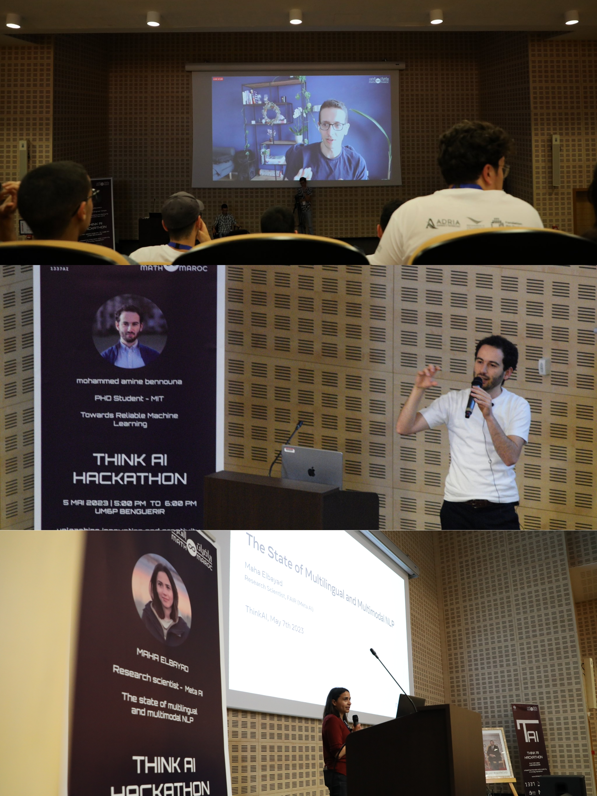

# ThinkAI

Welcome to the official repository for the ThinkAI Hackathon organized by Math&Maroc and 1337AI! This repository is dedicated to showcasing the works of the talented participants who took part in this exciting event.

ThinkAI is a premier AI Hackathon that took place from May 5th to May 7th at 1337 Coding School in Morocco. The event brought together students from various Moroccan schools to demonstrate their creativity and expertise in the field of Artificial Intelligence. It provided a platform for participants to solve real-world problems using AI technologies and explore the potential of AI in different domains.

Throughout the hackathon, participants formed teams and worked on projects related to Natural Language Processing (NLP), Generative AI, and AI product development. The event spanned three days of intense competition, innovation, and collaboration among bright Moroccan minds.
As a testament to their hard work and achievements, many trophies were awarded and a prize of 600euros was given to each winning team in each challenge category. 

For more information, feel free to check our dedicated website: https://thinkai.ma/
## Sponsors
We would like to express our sincere gratitude to our sponsors whose generous support made this event possible:

 - [Adria Business](https://adria-bt.com/)
 - [Fondation Ibn Rochd pour les Sciences et l'Innovation](https://www.firsi.org/)
 - [1337 Coding School](https://1337.ma/)
 - [MSDA, UM6P](https://msda.um6p.ma/)
 - [SOLE, UM6P](https://www.linkedin.com/company/student-organisations-leadership-and-engagement-sole/)

## Speakers
We were honored to have esteemed speakers from Europe, Morocco, and the United States who delivered inspiring conferences during the event. They shared their expertise, knowledge, and insights to motivate and inspire our contestants. The speakers included:

- Mohammed Amine Bennouna (MIT)
- Maha Elbayad (Meta AI)
- Ahmed Kachkach (Google)

We express our sincere gratitude to these distinguished speakers for their valuable contributions to the event and for inspiring the participants to push the boundaries of AI.

## Participants Projects & Conference Slides
This repository serves as a platform to showcase the projects developed by the talented participants of the ThinkAI Hackathon as well as the slides used in the conferences. You will find a collection of innovative solutions, creative implementations, and novel approaches that demonstrate the participants' skills and ingenuity. Each project will be presented in a separate folder, providing documentation, source code, and any additional resources related to the project.

We invite you to explore the projects and witness the impressive outcomes achieved by the participants during the hackathon.

## Acknowledgements
We would like to express our heartfelt appreciation to our incredible volunteers from Math&Maroc, UM6P, and beyond. Their dedication, support, and hard work were instrumental in ensuring the success of this event. Without their contribution, organizing such a remarkable hackathon would not have been possible.

We also extend our gratitude to all the participants who enthusiastically participated in the ThinkAI Hackathon. Your enthusiasm, passion, and commitment to innovation were truly inspiring, and we are thrilled to have witnessed the amazing projects you developed during this event.

## Contact Information
For any inquiries or further information about the ThinkAI Hackathon, please visit our dedicated website thinkai.ma or reach out to us via email at ia.mathmaroc@gmail.com.

Thank you for your interest in the ThinkAI Hackathon!

